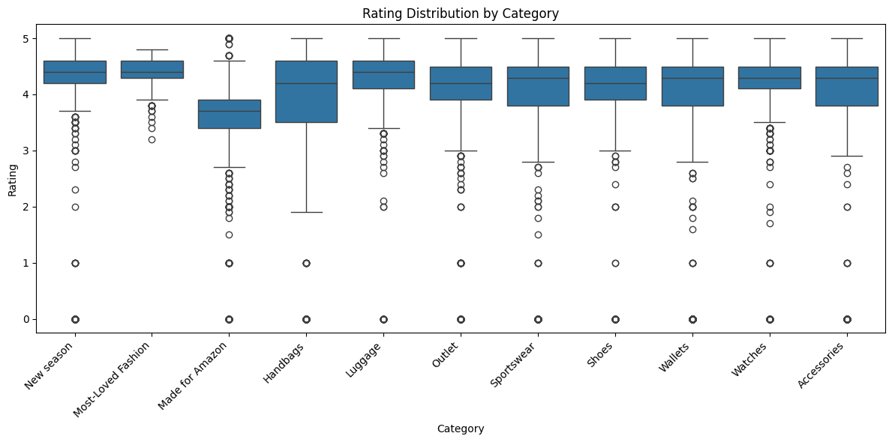

# Amazon Fashion Sales - EDA Analysis
---

## Executive Summary
[Full Business Summary (PDF)](amazon_product_business_summary.pdf)

This project applies Exploratory Data Analysis (EDA) to an Amazon Fashion Products dataset.

The goal for this project is to uncover key trends in brands, pricing, categories, and ratings to help Amazon fashion sellers and buyers make data-driven decisions.

---

## Preview of Key Findings 
- **Categories** – The Most-Loved Fashion category holds the highest average rating and one of the largest numbers of product listings in the dataset.
- **Price Distribution** – The majority of Amazon fashion products fall in the lower- to mid-price range and are not considered high-end.
- **Price vs. Rating** – Correlation ≈ 0.03, there is no relationship between price and rating.

> Full details are in the  
> [Executive Summary PDF](reports/Amazon_Fashion_Analysis_Summary.pdf).

---
## Business Strategies and Recommendations (Preview)

- **Pricing** - Sellers on Amazon should prioritize low to mid end prices, considering most fashion products are not high-end on Amazon, in terms of pricing.
- **Prioritization** - Companies selling bags should prioritize Amazon as one of their main channels, as bags are highly rated on Amazon.

---

## Visual Highlights
| Type of Visualization | Description |
|-------|------------|
|  |Minimal relationship between price and ratings|
|  | Market dominated by low to mid end pricing |
|  | Most categories are rated between the 4.0 to 5.0 range |
---

## 🧮 Data & Methods
- **Dataset** – Cleaned to 1,787 rows and 4 key variables: `brand`, `price`, `category`, and `rating`.  
- **Cleaning Steps** – Standardized column names, converted numeric fields, and removed missing or invalid values.  
- **Tools** – Python, Pandas, NumPy, Matplotlib, Seaborn.  
- **Notebook** – See [`notebooks/amazon_fashion_eda.ipynb`](notebooks/amazon_fashion_eda.ipynb) for full EDA workflow.

---

## 🔜 Next Steps
- **Quantify key metrics** – Extract KPIs such as category growth rates, review volumes, and price–rating relationships to measure the trends discovered in the initial EDA.  
- **Cross-platform comparison** – Perform EDA on other e-commerce platforms (e.g., Walmart, eBay) to benchmark category and brand performance as well as pricing strategies.

